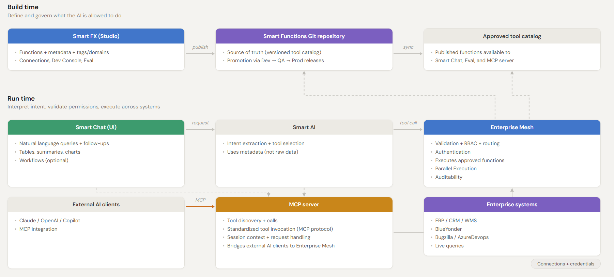

# Architecture

This page provides a high-level overview of how Smart AI transforms a user-defined business intent—created in SmartFX—into actionable outcomes. It shows how the Enterprise Mesh acts as a data orchestration layer, unifying and coordinating data across systems, and how users can then interact with this intelligence through natural language chat or via tools exposed through an MCP server.

> _Build approved functions in Smart FX → execute securely via Enterprise Mesh → deliver results in Smart Chat or via MCP._

---

## Core components

### [Smart FX](./smart-fx.md)

**Smart FX is the Smart Functions workbench where your team builds and maintains the approved capabilities that Smart AI can execute.**

In simple terms, Smart FX defines **what Smart AI is allowed to do** and ensures those capabilities are **clear, consistent, reviewable, and safely deployed through your existing release process**.

If you only use Smart Chat to ask questions or run approved actions, you typically don’t interact with Smart FX directly.

---

### [Enterprise Mesh](./enterprise-mesh.md)

Enterprise Mesh is the **secure execution layer of Smart AI**.

It connects Smart Chat requests to approved enterprise systems and ensures every operation is **validated, governed, and executed in real time**.

At a high level, Enterprise Mesh is **query-centric**: instead of copying or syncing data, it sends queries directly to enterprise systems and merges results into a **single, unified response based only on approved functions and permissions**.

It:

- orchestrates requests across enterprise systems (WMS, ERP, CRM)  
- validates inputs and enforces permissions (RBAC) before execution  
- executes approved logic from Smart Functions  
- aggregates and transforms results into a single, trusted response  

---

### [Smart Chat](./smart-chat.md)

Smart Chat is the **secure conversational interface of Smart AI**.

It allows users to interact with enterprise systems using natural language while ensuring only **approved functions, actions, and data access** are executed.

Smart Chat:

- translates natural language into approved Smart Functions (secure API calls)  
- retrieves live operational data from connected enterprise systems  
- supports follow-up questions with full conversation context  
- formats results as tables, summaries, charts, or dashboards  

Smart Chat is designed for **execution, not just document search**, enabling real-time operational queries and approved workflows.

---

## End-to-end request flow

1. **User request:** A user asks a question in Smart Chat (e.g., “Show me details of order 123”)
2. **Intent extraction:** Smart AI interprets the request into a Smart Function + parameters
3. **Validation:** Enterprise Mesh validates function existence, inputs, and user permissions
4. **Execution:** Approved logic runs against enterprise systems (MOCA, REST, SQL, etc.)
5. **Aggregation:** Results from multiple systems are merged if needed
6. **Response:** Smart Chat returns a formatted output (table, summary, chart, or dashboard)

---

## Security model (high level)

- **Approved functions only:** Only published Smart Functions can be executed
- **Role-based access (RBAC):** Users only access what their role allows
- **Data protection:** Execution stays inside your controlled environment
- **Minimal LLM exposure:** Only intent-related metadata is used for interpretation
- **Controlled analytics:** Full business data is not exposed externally; only governed metadata or optional samples (if enabled) are used for summarization

---
