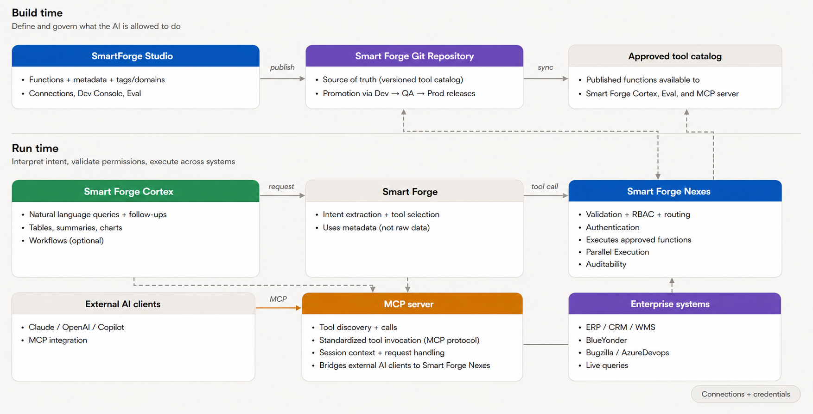

# Architecture

This page provides a high-level overview of how SmartForge transforms a user-defined business intent—created in SmartForge Studio into actionable outcomes. It shows how SmartForge Nexes acts as a data orchestration layer, unifying and coordinating data across systems, and how users can then interact with this intelligence through natural language chat or via tools exposed through an MCP server.

> _Build approved functions in SmartForge Studio → execute securely via SmartForge Nexes → deliver results in SmartForge Cortex or via MCP._

---

## Core components

### [SmartForge Studio](./smart-fx.md)

**SmartForge Studio is a workbench where your team builds and maintains the approved functions that SmartForge can execute.**

In simple terms, SmartForge Studio defines **what SmartForge is allowed to do** and ensures those capabilities are **clear, consistent, reviewable, and safely deployed through your existing release process**.

If you only use SmartForge Cortex to ask questions or run approved actions, you typically don’t interact with SmartForge Studio directly.

---

### [SmartForge Nexes](./enterprise-mesh.md)

SmartForge Nexes is the **secure execution layer of SmartForge**.

It connects SmartForge Cortex requests to approved enterprise systems and ensures every operation is **validated, governed, and executed in real time**.

At a high level, SmartForge Nexes is **query-centric**: instead of copying or syncing data, it sends queries directly to enterprise systems and merges results into a **single, unified response based only on approved functions and permissions**.

It:

- orchestrates requests across enterprise systems (WMS, ERP, CRM)  
- validates inputs and enforces permissions (RBAC) before execution  
- executes approved logic from functions  
- aggregates and transforms results into a single, trusted response  

---

### [SmartForge Cortex](./smart-chat.md)

SmartForge Cortex is the ** AI-powered secure conversational interface of SmartForge**.

It allows users to interact with enterprise systems using natural language while ensuring only **approved functions, actions, and data access** are executed.

SmartForge Cortex:

- translates natural language into approved functions (secure API calls)  
- retrieves live operational data from connected enterprise systems  
- supports follow-up questions with full conversation context  
- formats results as tables, summaries, charts, or dashboards  

SmartForge Cortex is designed for **execution, not just document search**, enabling real-time operational queries and approved workflows.

---

## End-to-end request flow

1. **User request:** A user asks a question in SmartForge Cortex (e.g., “Show me details of order 123”)
2. **Intent extraction:** SmartForge interprets the request into a function + parameters
3. **Validation:** SmartForge Nexes validates function existence, inputs, and user permissions
4. **Execution:** Approved logic runs against enterprise systems (MOCA, REST, SQL, etc.)
5. **Aggregation:** Results from multiple systems are merged if needed
6. **Response:** SmartForge Cortex returns a formatted output (table, summary, chart, or dashboard)

---

## Security model (high level)

- **Approved functions only:** Only published functions can be executed
- **Role-based access (RBAC):** Users only access what their role allows
- **Data protection:** Execution stays inside your controlled environment
- **Minimal LLM exposure:** Only intent-related metadata is used for interpretation
- **Controlled analytics:** Full business data is not exposed externally; only governed metadata or optional samples (if enabled) are used for summarization

---

