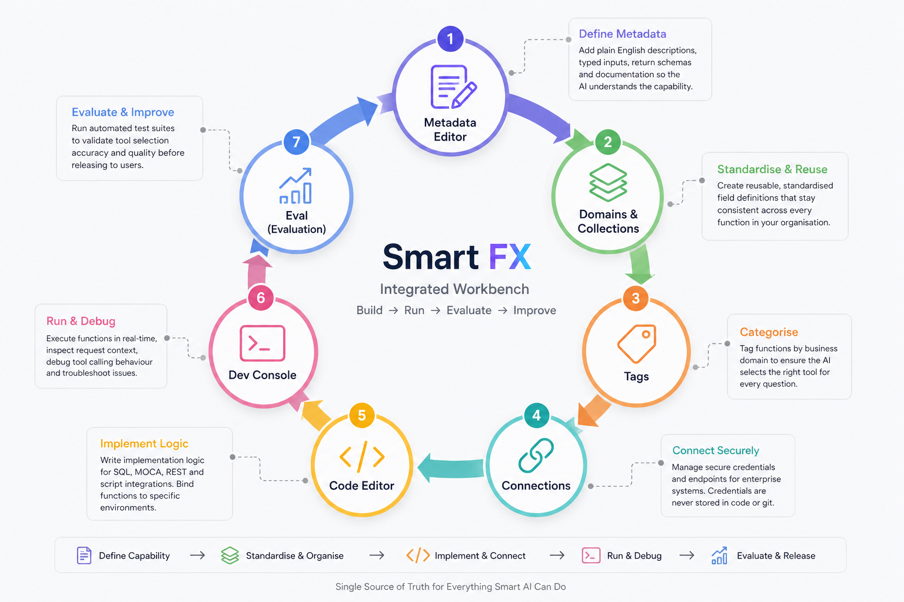

#### OVERVIEW

# What is Smart AI?

Smart AI is an enterprise intelligence layer that sits on top of your existing systems. You ask a question in natural language. Smart AI understands what you're looking for, fetches live data from all your enterprise systems in parallel, merges the results intelligently, and returns a single trusted answer — all in seconds.

Think of it as a universal interpreter for your enterprise. Instead of logging into four different systems to answer one business question, you ask once — and get a complete, accurate answer built from every relevant source simultaneously.

---

#### Why Smart AI Exists

# The fragmentation problem

<table style="width:100%; border-collapse:collapse;">
  <tr>
    <td style="width:50%; padding:1.5rem; text-align:center; border:1px solid #ccc; vertical-align:top; background-color:#ffffff; color:#000000;">
      <strong>Multiple systems, zero integration</strong>  
      ERP handles orders and financials. WMS owns inventory and logistics. TMS manages transportation and tracking. CRM tracks customers. Each system has part of the answer — but no system has all of it.
    </td>
    <td style="width:50%; padding:1.5rem; text-align:center; border:1px solid #ccc; vertical-align:top; background-color:#ffffff; color:#000000;">
      <strong>Repeated manual queries</strong>  
      A single business question — "where is this order?" — requires querying 3 or more systems, then manually reconciling the results. Teams do this dozens of times a day, every day.
    </td>
  </tr>
  <tr>
    <td style="padding:1.5rem; text-align:center; border:1px solid #ccc; vertical-align:top; background-color:#ffffff; color:#000000;">
      <strong>Business logic trapped in dashboards</strong>  
      Custom dashboards and reports exist because the systems can't talk to each other. But dashboards go stale, break silently, and require constant maintenance as systems change.
    </td>
    <td style="padding:1.5rem; text-align:center; border:1px solid #ccc; vertical-align:top; background-color:#ffffff; color:#000000;">
      <strong>Decision delays from data lag</strong>  
      By the time teams pull reports, reconcile data across systems, and distribute answers, the underlying situation may already have changed. Slow answers mean slower decisions.
    </td>
  </tr>
</table>

#### The Smart AI Solution
# One Question. Every system. Real time

Smart AI solves fragmentation at the source. Instead of forcing humans to manually query and reconcile data across systems, Smart AI sends questions directly to each system simultaneously — and combines the results into a single, trustworthy answer.

- No data is ever copied between systems. Smart AI queries your systems directly — your data stays where it lives.
- All queries run in parallel. A question that previously took a person 10 minutes across 3 systems is answered in seconds.
- Business logic is encoded once in Smart AI, not scattered across dozens of custom dashboards.
- Every answer is role-aware. Users see only the data they're permitted to see — no more, no less.
- Every query is audited. There is a complete log of what was asked, what systems were queried, and what was returned.

## Real-world example: Order status visibility
This is the most common cross-system query in any fulfilment operation. Here's how the same question is answered before and after Smart AI.

| # | Without Smart AI | With Smart AI |
|---|---|---|
| 1 | Log into ERP → search order 12345 → check order status | User types:  *"Where is order 12345?"* |
| 2 | Log into WMS → find the order → check fulfilment status | Smart AI queries ERP, WMS, and TMS simultaneously |
| 3 | Log into TMS → locate shipment → find tracking number | Results are merged and validated automatically |
| 4 | Manually reconcile all three results into one answer | **Response:**  "Packed and ready for pickup at Warehouse 5. Scheduled delivery: 2:00 PM tomorrow." |
| | **Outcome:**   Avg. 8–12 minutes per query   3 systems involved   Manual reconciliation required | **Outcome:**   Under 3 seconds   All 3 systems connected   Zero manual steps |

---

# The Three Pillars

Smart AI is built on three tightly integrated components. Each one has a distinct role. Together, they form a complete system — from how you ask questions, to how capabilities are defined, to how queries are safely executed.

## Pillar 1: Smart FX
### Define capabilities
Smart FX is the workbench where builders and integrators define what Smart AI can do. Every capability in Smart Chat exists because someone built a Function (also called an Intent) in Smart FX. This is where business logic lives — clearly defined, versioned, and reusable.

## Pillar 2: Enterprise Mesh
### Secure execution
Enterprise Mesh is the execution engine that actually talks to your systems. When Smart Chat identifies which function to run, Enterprise Mesh validates the request, dispatches queries to each connected system in parallel, and applies the reducer logic to merge results into a single coherent response.

What happens during a query:

1. The request is validated against the user's role (RBAC) and the function's allowed inputs
2. Queries are dispatched simultaneously to all relevant systems — ERP via SQL, WMS via MOCA, TMS via REST API
3. Results are merged using precedence rules defined in the function's reducer
4. A single unified result is returned to Smart Chat — and the user
5. All activity is logged with masked sensitive data for audit compliance

Core capabilities of Enterprise Mesh:

- **Federation**   Run the same logical query across multiple systems simultaneously   *ERP + WMS + TMS in one call*
- **Aggregation**   Combine live data from multiple sources into a single result set   *Available-to-promise inventory*
- **RBAC enforcement**   Every query is scoped to what the requesting role is permitted to see   *Role-based data views*
- **Reducer logic**   Intelligent merging with source-of-truth precedence rules   *Delay detection across sources*

#### Inventory proof — how aggregation works
WMS reports 500 units on-hand. TMS reports 150 units in transit. ERP reports 200 units on order. Enterprise Mesh aggregates all three into a live ATP (Available-to-Promise) table — without any data movement or ETL pipeline.

## Pillar 3: Smart Chat
### How you interact
Smart Chat is the conversational interface where end users and business teams interact with their data. You ask questions in plain English — it handles the rest. You can ask follow-up questions, request visualisations, and set up automated workflows, all from the same interface.

What you can do in Smart Chat:

- Ask live data questions:
  `"How many orders were delayed today?"`
- Drill down with follow-ups:
  `"Filter to the Southeast region only"`
- Request visualisations:
  `"Show that as a pie chart"`
- Automate recurring queries:
  `"Send this as a weekly email report"`
- Trigger actions directly within connected systems

#### Smart Chat vs. traditional document chat

| Feature | Document Chat | Smart Chat |
|---|---|---|
| Data source | Static PDF / uploaded files | Live enterprise systems |
| Data freshness | Stale at upload time | Real-time, always current |
| Can execute actions | No | Yes |
| Multi-system queries | No | Yes — parallel queries |
| Role-based access | No | Yes — enforced per query |

### Security by design
Smart Chat only executes approved functions. Every query is validated against the user's role and permissions. Data never leaves your network. Every interaction is logged for audit.

---

## Real Example
### Seeing it all come together
Here's what happens under the hood when a logistics manager asks Smart Chat a question. This example shows the full round-trip from question to answer.

**Live scenario — Order status query**

**User asks:**  
_"Where is order 12345? Is it going to be delayed?"_

 

**Behind the scenes:**
1.  Intent matched → `get_order_status` (order_id="12345")
2.  Permissions validated — user role: Logistics Manager
3.  Querying ERP (SQL) · WMS (MOCA) · TMS (REST) — in parallel
4.  Reducer applied — TMS result used as authoritative for transit status
5.  Delay check: expected vs. scheduled delivery — no delay detected

 

**AI answers:**  
Order 12345 is packed and awaiting carrier pickup at Warehouse 5. The shipment is on schedule with an estimated delivery of 2:00 PM tomorrow. No delays detected.

**User follows up:**  
_"Show me all delayed orders for the Southeast region today."_

 

**Behind the scenes:**
1.  Intent matched → `get_delayed_orders` (region="Southeast", date=today)
2.  Parallel query dispatched to TMS + ERP

 

**AI answers:**  
Found 7 delayed orders in the Southeast today. Top reason: carrier delay (5 orders). Would you like a breakdown by carrier or a chart?

---

## Who uses what
### Smart AI by role
Smart AI is designed to serve every stakeholder in the enterprise — from business users who just need answers, to IT and security teams who need governance and auditability.

| Role | Responsibility | Primary interface |
|---|---|---|
| **Business users** | Ask questions in plain English via Smart Chat. Get live answers, charts, and automated reports. No technical knowledge required. | Smart Chat |
| **Power Users** | Define new capabilities in Smart FX Studio. Write function metadata, implement queries, tag domains, and validate accuracy using Eval. | Smart FX Studio |
| **Admins** | Configure secure Connections to enterprise systems. Implement SQL, MOCA, and REST query logic inside functions. Bridge existing systems to the Smart AI platform. | Smart AI

---

# Summary

Smart AI solves the fundamental fragmentation problem of enterprise data: the fact that no single system holds the full answer to any meaningful business question.

It does this through three tightly integrated components:
- **Smart Chat** (how you interact) 
- **Smart FX** (how capabilities are defined)
- **Enterprise Mesh** (how queries are securely executed across systems).

Together, they deliver real-time, governed, trustworthy answers from all your systems — through a single conversational interface.
