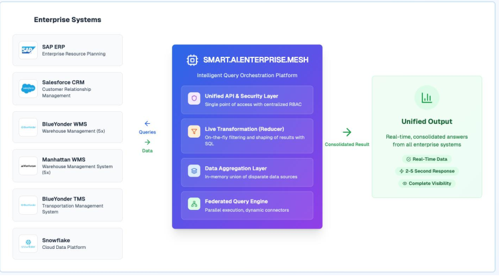
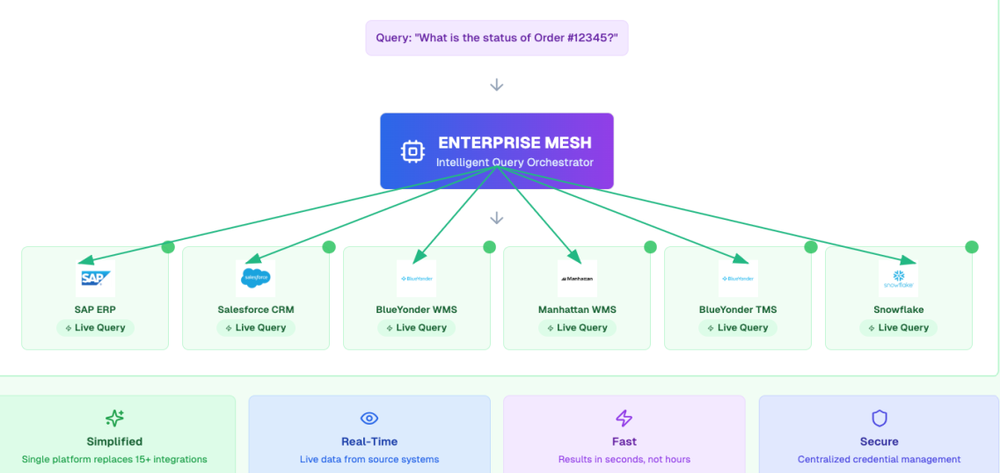
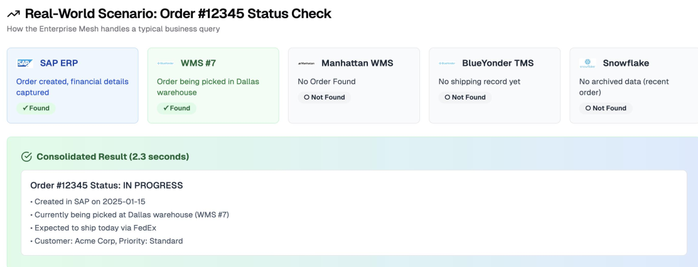
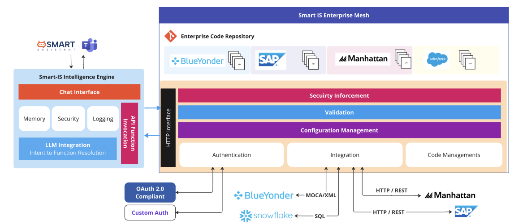

# Enterprise Mesh

**Enterprise Mesh is the secure execution layer of Smart AI.**  
It connects Smart Chat requests to approved enterprise systems and returns a single, trusted answer—safely, consistently, and in real time.

At a high level, Enterprise Mesh is **query-centric**: instead of copying or syncing data between systems, it sends the query directly to each system and combines the results into one unified response—based only on what your organization has approved.

---

## Query-Centric Architecture

The diagram below illustrates how Enterprise Mesh queries multiple systems in parallel and combines results into a single answer:

---

## What Enterprise Mesh does

- **Routes requests** to the correct system (WMS, ERP, CRM) using native protocols (REST, MOCA, SQL, etc.)
- **Validates inputs** (required parameters, formats, allowed values) before execution
- **Enforces permissions (RBAC)** so users can only execute approved actions
- **Executes approved logic** from the Smart Functions Git repository (scripts, MOCA commands, APIs, workflows)
- **Standardizes access** so different systems behave consistently in Smart Chat

### Enterprise Mesh Integration

Enterprise Mesh connects to multiple enterprise systems using native protocols and approved integrations:

---

## Why it matters

Enterprise Mesh makes Smart AI truly **actionable**:

- **Live data, always** — responses come directly from source systems  
- **Governed execution** — only approved functions can run  
- **Consistent experience** — same behavior across Teams, web, and desktop  
- **Faster decisions** — no manual system switching or delays  

---

## Ask once, see everything

Enterprise Mesh is most powerful when information is distributed across systems.

---

### Where is my order?

Order status is often split across ERP, WMS, and TMS.

Enterprise Mesh:
1. Queries all relevant systems in parallel  
2. Merges responses into a unified dataset  
3. Applies reducer logic (business-defined precedence rules)  
4. Returns a **single, definitive status**

#### Example: Order Status (Order #12345)

Below is a real-world example of how Enterprise Mesh retrieves and combines order status from multiple systems into a single response:

---

### True inventory for a SKU

Inventory is often spread across multiple categories:

- On-hand (WMS)  
- In-transit (TMS)  
- On-order (ERP)  

Enterprise Mesh:
- Queries all sources in real time  
- Combines results into one dataset  
- Calculates a unified **available-to-promise (ATP)** value (if configured)  

---

## How answers are produced

For each request, Enterprise Mesh may perform:

- **Federated queries**  
  Parallel requests to multiple systems using native protocols  

- **Live aggregation**  
  Real-time merging of responses into a single dataset  

- **On-the-fly transformation**  
  Filtering, grouping, or calculations applied dynamically  

- **Unified API + security layer**  
  A single secure interface for Smart AI, hiding backend complexity  

---

## End-to-end flow (simplified)

1. User asks a question in Smart Chat  
2. LLM identifies intent and parameters  
3. Enterprise Mesh selects the approved function  
4. Queries relevant systems in parallel  
5. Aggregates and transforms results  
6. Applies business logic (reducer rules)  
7. Returns a single, trusted answer  

### Solution Architecture

The diagram below shows how Smart AI, Enterprise Mesh, and enterprise systems interact:

---

## Security and data handling

Enterprise Mesh is designed to keep sensitive data **inside your environment**:

- The LLM is used only for **intent interpretation**  
- Execution happens through **approved functions within your network**  
- **No raw business data is exposed externally**  
- Only limited metadata may be used for analytics or visualization  

All behavior is controlled by your organization’s security policies.

---

## Tracking and auditability

Enterprise Mesh supports secure observability for troubleshooting and audits.

Depending on configuration, tracking may include:

- **Who** initiated the request and **when**  
- **Which approved function** was executed  
- **Run IDs and execution timings**  
- **Masked parameters** and high-level schema details (e.g., column names, row counts)  

> Sensitive business data and payloads are never exposed in logs.

---

## What makes Enterprise Mesh different

- No data duplication (no ETL required)  
- Real-time query execution (not batch-based)  
- Works with existing systems (no replacement needed)  
- Built-in security and governance (RBAC + approved functions)  
- Low-code, Git-driven extensibility  

---

## When to use Enterprise Mesh

Use Enterprise Mesh when:

- Data is spread across multiple systems  
- Real-time answers are required  
- Actions must be secure and governed  
- A unified, user-friendly interface is needed  

---