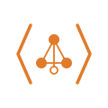
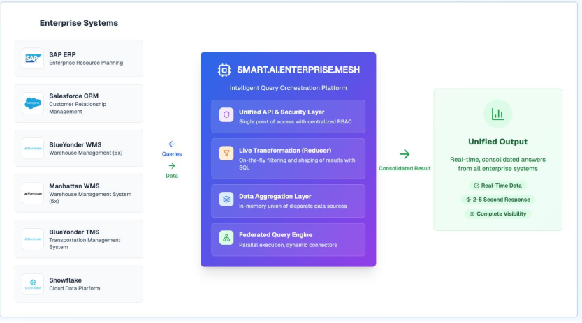
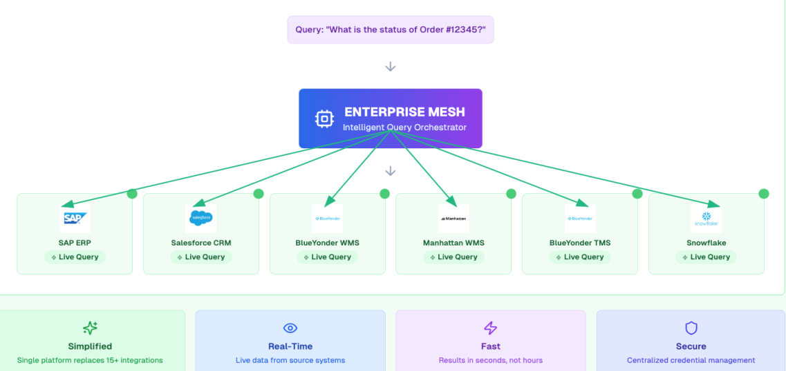
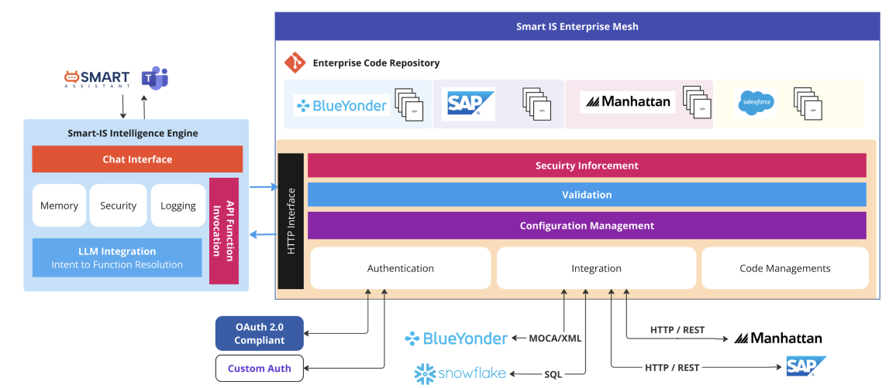
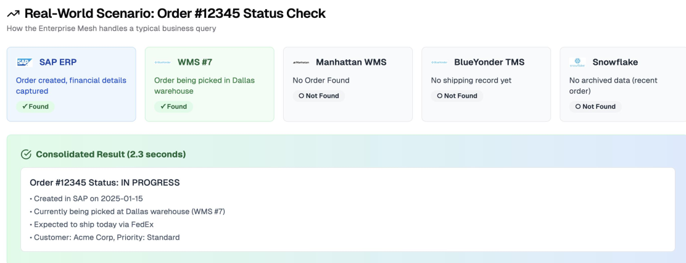

#  SmartForge Nexes

**SmartForge Nexes is the secure execution layer of SmartForge.**  
It connects SmartForge Cortex requests to approved enterprise systems and returns a single, trusted answer—safely, consistently, and in real time.

At a high level, SmartForge Nexes is **query-centric**: instead of copying or syncing data between systems, it sends the query directly to each system and combines the results into one unified response—based only on what your organization has approved.

---

## At a glance

- **Purpose:** Securely connect SmartForge to enterprise systems  
- **Architecture:** Query-centric (no data replication)  
- **Core capability:** Real-time federated queries + unified responses  
- **Security model:** RBAC + approved functions  
- **Outcome:** One trusted answer from multiple systems  

---

## Who is this for

- Business users needing real-time answers  
- Operations teams (WMS, ERP, TMS)  
- IT and integration teams  
- AI / automation teams  

---

## Query-Centric Architecture

SmartForge Nexes executes queries directly on source systems and merges results in real time.

The diagram below shows how queries are executed in parallel and combined into a single response:

---

## Core capabilities

- **Routes requests** to the correct system (WMS, ERP, CRM) using native protocols  
- **Validates inputs** (required parameters, formats, allowed values) before execution  
- **Enforces permissions (RBAC)** so users can only execute approved actions  
- **Executes approved logic** from the functions Git repository  
- **Standardizes access** so different systems behave consistently in SmartForge Cortex  

---

## Integrations

SmartForge Nexes connects to enterprise systems using native protocols and approved integrations:

- REST APIs  
- MOCA commands  
- SQL queries  
- Custom workflows  

The diagram below illustrates how SmartForge Nexes integrates with multiple enterprise systems:

---

## How answers are produced

For each request, SmartForge Nexes performs a combination of:

- **Federated queries**  
  Parallel requests to multiple systems using native protocols  

- **Live aggregation**  
  Real-time merging of responses into a single dataset  

- **On-the-fly transformation**  
  Filtering, grouping, and calculations applied dynamically  

- **Unified API + security layer**  
  A single secure interface that abstracts backend complexity  

---

## End-to-end flow (simplified)

This flow shows how a user query is processed from input to final response:

1. User asks a question in SmartForge Cortex  
2. LLM identifies intent and parameters  
3. SmartForge Nexes selects the approved function  
4. Queries relevant systems in parallel  
5. Aggregates and transforms results  
6. Applies business logic (reducer rules)  
7. Returns a single, trusted answer  

The diagram below shows how SmartForge, SmartForge Nexes, and enterprise systems interact:

---

## Key use cases

### Order status visibility

Order status is often split across ERP, WMS, and TMS.

SmartForge Nexes:
1. Queries all relevant systems in parallel  
2. Merges responses into a unified dataset  
3. Applies reducer logic (business-defined precedence rules)  
4. Returns a **single, definitive status**  

The diagram below shows how multiple systems contribute to a single order status:

---

### Unified inventory view

Inventory is often distributed across systems:

- On-hand (WMS)  
- In-transit (TMS)  
- On-order (ERP)  

SmartForge Nexes:
- Queries all sources in real time  
- Combines results into one dataset  
- Calculates a unified **available-to-promise (ATP)** value (if configured)  

---

## Why it matters

SmartForge Nexes makes SmartForge truly **actionable**:

- **Live data, always** — responses come directly from source systems  
- **Governed execution** — only approved functions can run  
- **Consistent experience** — same behavior across Teams, web, and desktop  
- **Faster decisions** — no manual system switching or delays  

---

## Security and data handling

SmartForge Nexes is designed to keep sensitive data **inside your environment**:

- The LLM is used only for **intent interpretation**  
- Execution happens through **approved functions within your network**  
- **No raw business data is exposed externally**  
- Only limited metadata may be used for analytics or visualization  

All behavior is controlled by your organization’s security policies.

---

## Tracking and auditability

SmartForge Nexes supports secure observability for troubleshooting and audits.

Depending on configuration, tracking may include:

- **Who** initiated the request and **when**  
- **Which approved function** was executed  
- **Run IDs and execution timings**  
- **Masked parameters** and high-level schema details  

> Sensitive business data and payloads are never exposed in logs.

---

## What makes SmartForge Nexes different

- No data duplication (no ETL required)  
- Real-time query execution (not batch-based)  
- Works with existing systems (no replacement needed)  
- Built-in security and governance (RBAC + approved functions)  
- Low-code, Git-driven extensibility  

---

## When to use SmartForge Nexes

Use SmartForge Nexes when:

- Data is spread across multiple systems  
- Real-time answers are required  
- Actions must be secure and governed  
- A unified, user-friendly interface is needed  

---

## Summary

SmartForge Nexes enables SmartForge to move beyond static answers and become a real-time, secure execution layer across enterprise systems—delivering trusted, actionable insights from distributed data.
