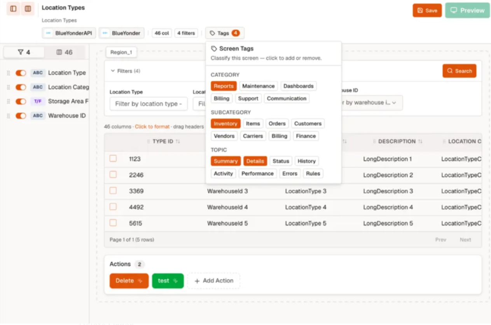
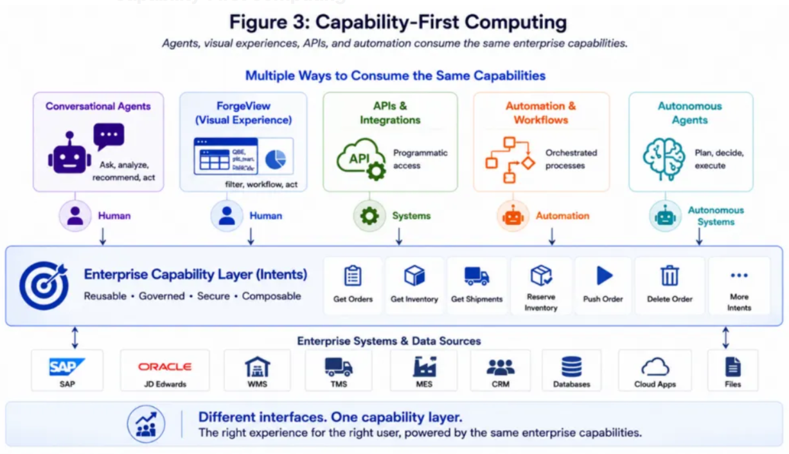

# ForgeView

## What is ForgeView?

ForgeView lets you turn your existing enterprise capabilities into visual screens — without writing any code.

Think of it this way: once you've defined what your system can do (like "get orders" or "check inventory"), ForgeView lets you present those capabilities as grids, charts, tabs, detail panels, and action buttons. Everything is assembled through configuration, not development.

> ForgeView is not a screen builder. It's a way to publish your existing capabilities into visual experiences.

---

## Why Do You Need Both Chat and Screens?

Natural language is great for asking questions:

- *"Show me delayed orders."*
- *"Reserve inventory for customer ABC."*
- *"Which shipments might miss their delivery date?"*

But once you get the answer, you often need to **scan, compare, sort, filter, or act on** a list of results. That's where visual screens shine.

A transportation planner reviewing hundreds of shipments. A warehouse supervisor tracking exceptions. A customer service rep checking order status across systems.

These users aren't just asking questions — they're **operating**. And operational work needs visual tools.

The key insight: **you don't have to choose**. The same capability can work through chat AND screens. Both consume the same underlying business logic — you just pick the interface that fits the moment.

---

## How ForgeView Works

1. A capability already exists as an intent (e.g., `get_orders`, `get_inventory`, `reserve_inventory`)
2. ForgeView maps that intent to visual elements — a grid, a chart, a detail panel, an action button
3. The screen appears — no new integrations, no new APIs, no new code

That's it. The same intent powers both your AI chat and your visual screens.

---

## Real Example: Order Management Screen

Say your organization already has intents that can:

- Pull orders from SAP or JD Edwards
- Check inventory across warehouses
- Look up shipment status
- Reserve inventory or push orders to fulfillment

Normally, building one screen that does all of this would take weeks — design, integration, development, testing, deployment.

**With ForgeView, you compose it.**

Orders appear in a master grid. Click an order, and tabs below show inventory and shipment details. Action buttons let you reserve inventory or push the order — all powered by intents you already built.

What happened behind the scenes?

- **No new integrations** were created
- **No new APIs** were developed
- **No new business logic** was written

Existing intents were simply mapped to visual elements. The screen emerged from what already existed.

---

## Capability-First Approach

Here's the big idea:

> The interface is a choice. The capability stays the same.

Instead of building separate versions for chat, screens, and APIs, you build the capability once. Then any consumer can use it:

- **Conversational agents** — natural language
- **ForgeView** — visual screens
- **APIs** — programmatic access
- **Automations** — scheduled workflows
- **Whatever comes next**

This is what we mean by **capability-first**. Not agent-first. Not screen-first. The capability is the asset. How you interact with it depends on what works best for you in that moment.

---

## Screen Forge: Creating and Editing Screens

**Screen Forge** is the visual screen editor inside SmartForge Studio. It's where you build and manage your screens by mapping intents to visual elements.

### What You Can Do

- **Create a new screen** — pick an intent and build a workspace around it
- **Add a grid** — show live data from any connected system
- **Add detail panels** — show related info when a record is selected
- **Organize with tabs** — group multiple views into one screen
- **Add action buttons** — trigger approved intents with a click
- **Edit or update** — change the layout, data source, or actions anytime
- **Publish** — make the screen available to end users

### Getting Started

1. Open your project in SmartForge Studio
2. Go to **Screen Forge**
3. Pick an intent to build around
4. Configure the grid, detail panels, tabs, and actions
5. Save and publish

No development projects. No waiting. Just capabilities you already own, presented the way your users need to see them.