# Smart Assistant - Getting Started Guide

## Overview

Smart Assistant integrates with existing enterprise systems that expose APIs  
(REST, proprietary protocols such as Blue Yonder MOCA, and others) —  
with no need for system replacement or migration.

It enables users to interact with systems using natural language while ensuring that only **secure and pre-approved operations** are executed.

---

## Requirements

Before setting up Smart Assistant, ensure the following prerequisites are in place:

- Access to **enterprise system endpoints** (e.g., WMS, ERP, CRM APIs)
- A configured **Smart Functions repository** for approved operations
- Defined **security policies and roles**
- Access to the **Smart Apps portal** to generate a Smart App Key

---

## Setup Guide

Follow the steps below to configure your Smart Assistant.

---

### Step 1: Access Smart Assistant

Open **www.smart-is.com** and log in using the available authentication options.

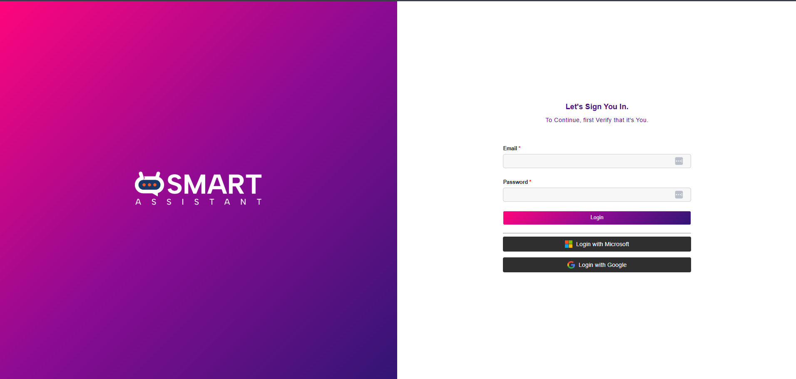

---

### Step 2: Dashboard Overview

After login, the dashboard appears showing total assistants and a sidebar menu:
- Dashboard  
- Create Assistant  
- Let’s Chat  
- Smart Chat Dashboard  
- Settings  

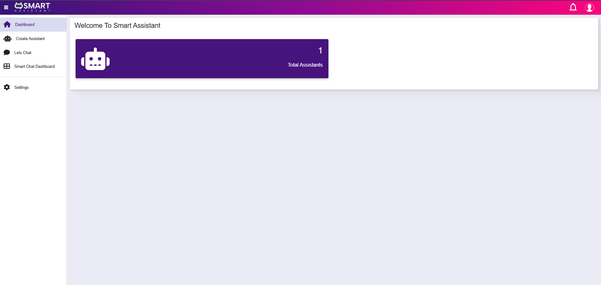

---

### Step 3: Open Create Assistant

Navigate to **Create Assistant** to view existing assistants or create a new one.

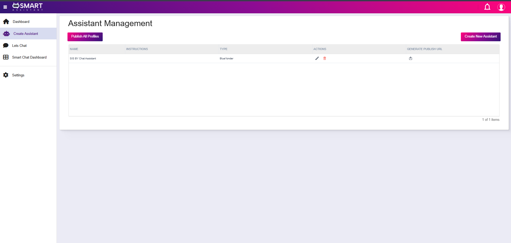

---

### Step 4: Select Assistant Type

Click **Create Assistant**, then choose from available assistant types:
- OpenAI  
- Blue Yonder  
- Smart Apps  
- Enterprise  
- Smart AI  

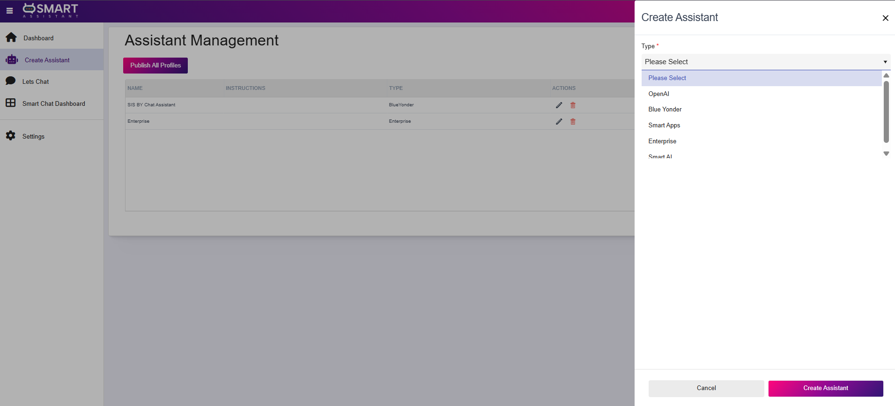

---

### Step 5: Enter Smart App Key

After selecting an assistant type, the system prompts for a **Smart App Key**.

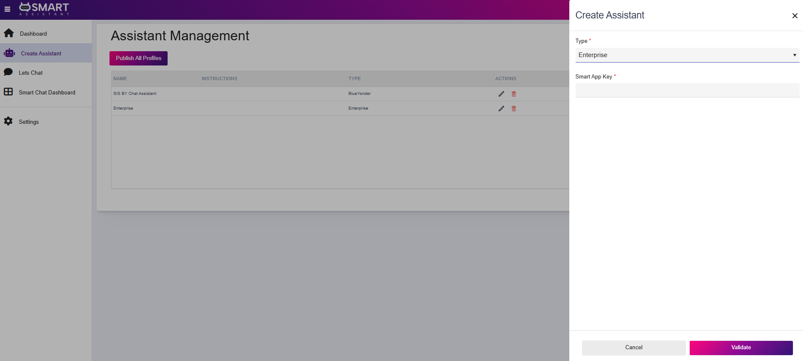

---

### Step 6: Open Smart Apps Portal

Navigate to the Smart Apps portal to generate a Smart App Key.

---

### Step 7: Create New App Key

From the Smart Apps dashboard, click **Create New App Key**.

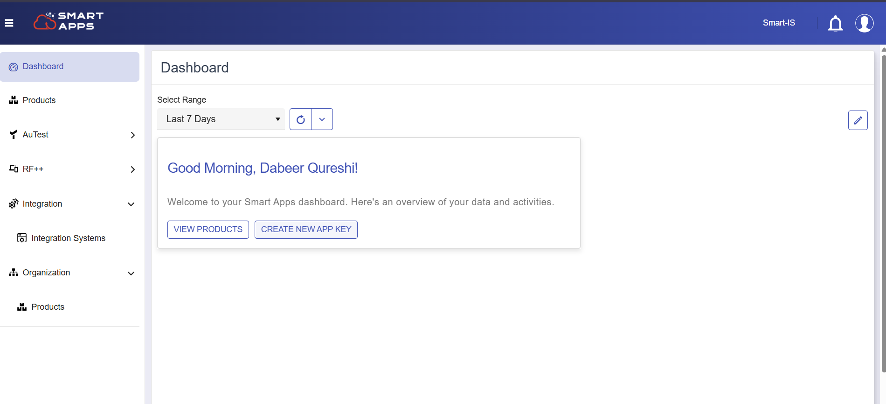

---

### Step 8: Initiate Key Creation

A new window appears — click **Add** to proceed.

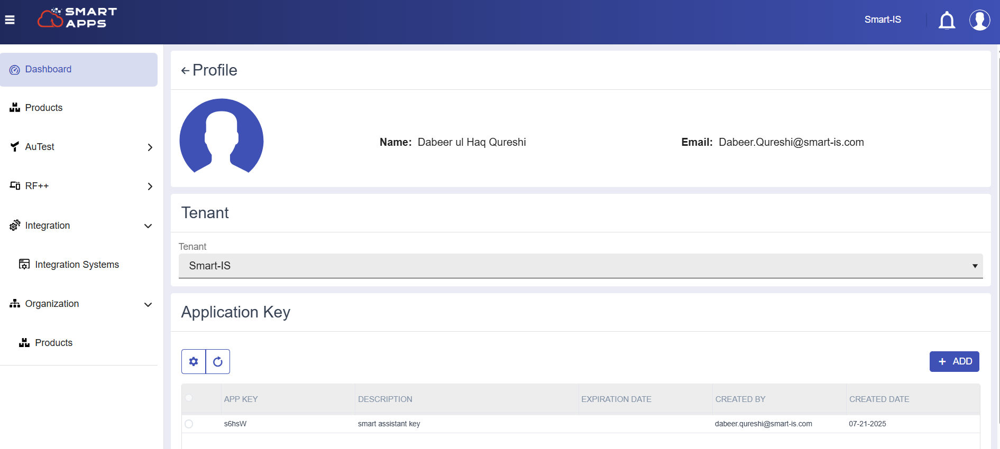

---

### Step 9: Generate and Save Key

Enter a description, generate the key, and save it securely for later use.

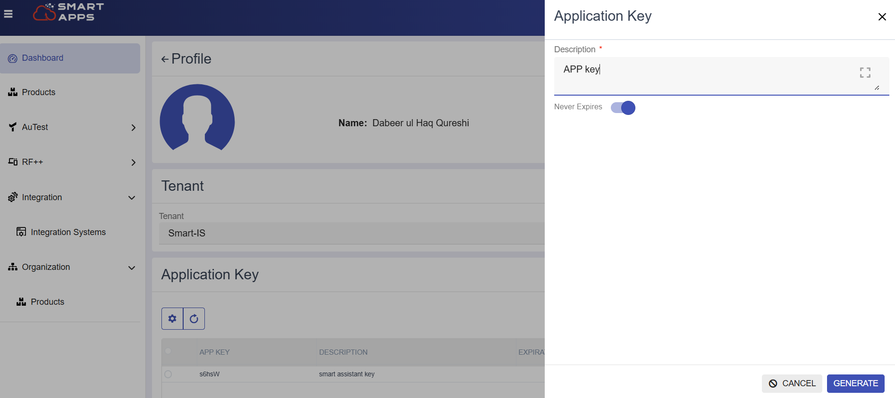

---

### Step 10: Validate Smart App Key

Return to Smart Assistant, enter the generated key, and click **Validate**.

---

### Step 11: Enter Credentials

Provide required credentials such as username, password, and other system details.

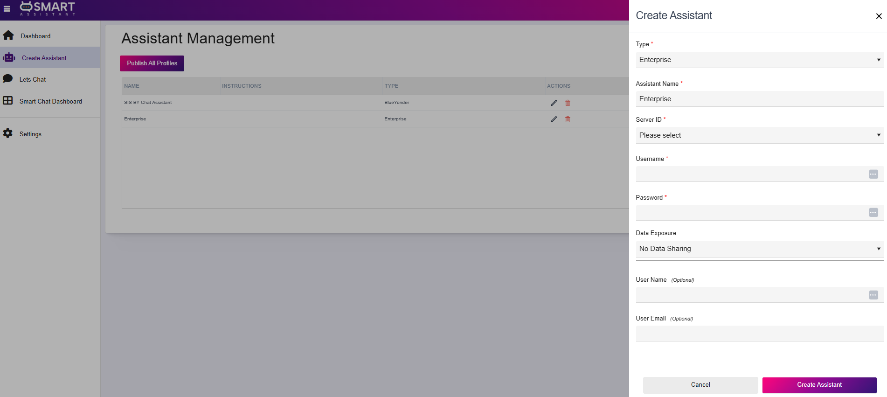

---

### Step 12: Configure Data Exposure

Select the desired data exposure level:
- No Data Sharing  
- Share Categorical Data Only  
- Share Limited Records  
- Share All Data  

Then click **Create Assistant** to complete the setup.

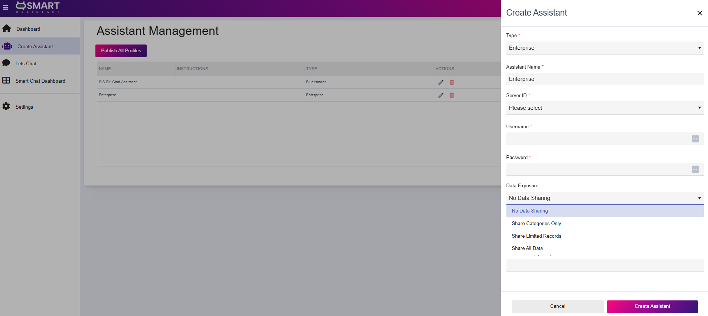

---

## How It Works

The Smart Assistant allows users to generate insights and build dashboards using natural language.

---

### Step 1: Open Chat and Select Assistant

Navigate to the chat section and select the desired assistant from the dropdown.

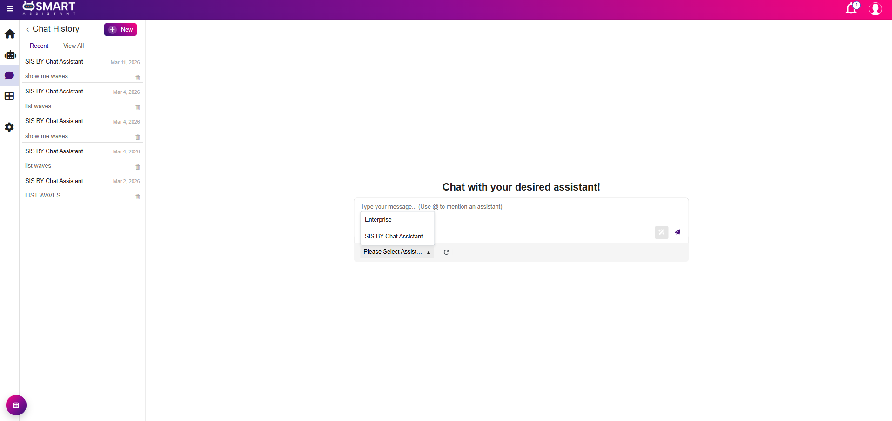

---

### Step 2: Generate Pie Chart

Enter a command like **"Generate pie chart"**.  
Once generated, add it to the dashboard using:  
**"Add this to dashboard"**

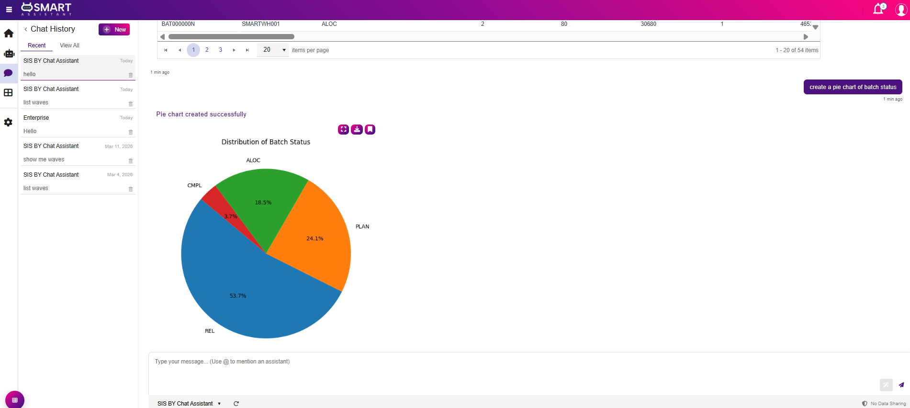

---

### Step 3: Generate Bar Chart

Enter a command like **"Generate bar chart"**.  
Add it to the dashboard using:  
**"Add this to dashboard"**

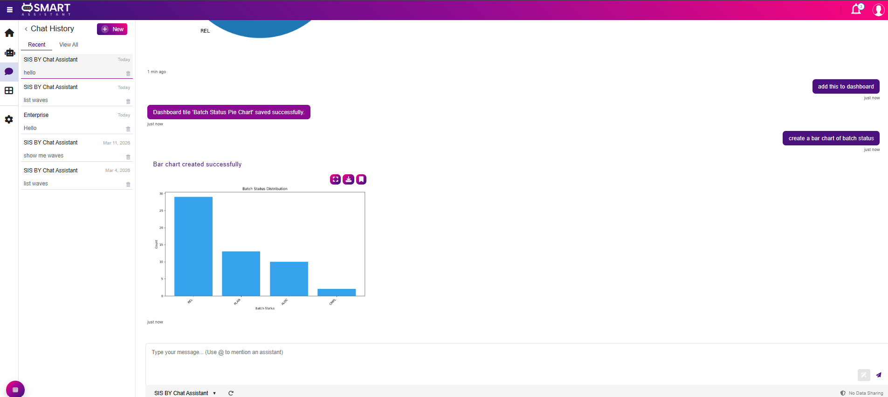

---

### Step 4: Generate Line Chart

Enter a command like **"Generate line chart"**.  
Add it to the dashboard using:  
**"Add this to dashboard"**

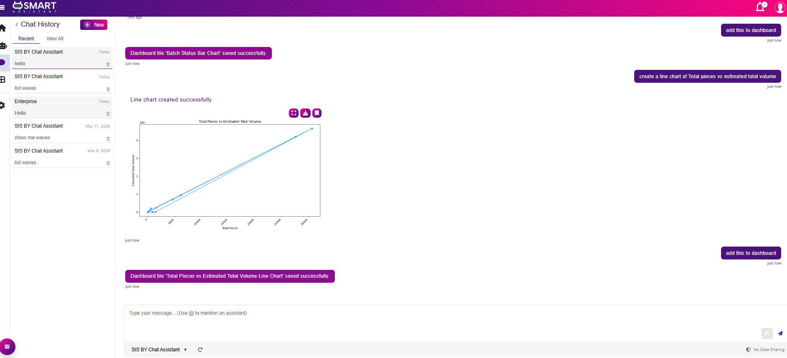

---

### Step 5: View Dashboard

All generated charts are consolidated and visible in the dashboard.

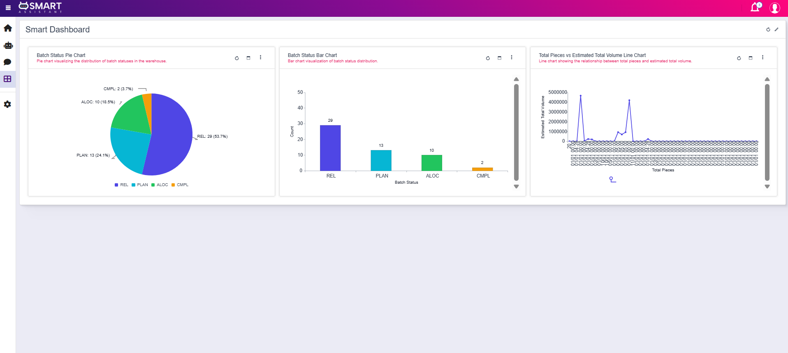

---

## Example

**User Request:**  
> "What is the status of wave BAT000000M in Warehouse SMARTWH001?"

**System Flow:**
- Identifies function: 'get_wave_status'
- Extracts parameters: Batch Code = BAT000000M, Warehouse ID = SMARTWH001 
- Executes secure backend call to the Wave / Batch table
- Returns response (e.g., { "Batch Code": "BAT000000M", "Batch Status": "REL" })

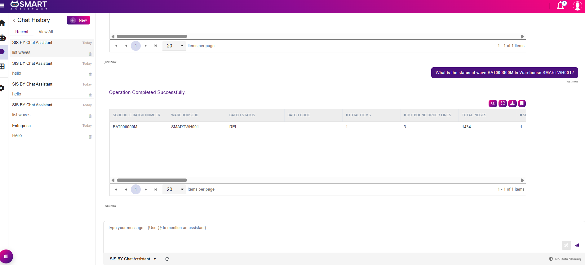

---

## Notes

- All operations are executed within secure enterprise boundaries  
- No unauthorized or ad-hoc system access is permitted  
- Smart App Keys should be stored securely and never shared publicly  

---