# Getting Started with Smart AI

Smart AI is an intelligent platform that allows you to connect to enterprise systems, add and manage your business logic, and interact with your data using simple, natural language. You can trigger business workflows, retrieve insights, and leverage AI-powered analysis through easy, conversational commands—making complex operations simple and accessible.

---

## Prerequisties

Before getting started, make sure you have:

1. A valid account (SSO / Email login)
2. A Git repository URL containing Smart Functions
3. A Personal Access Token (PAT) with repo access

---

## Step 1: Access the Portal

Go to: https://smartfunctions.smart-is.com/

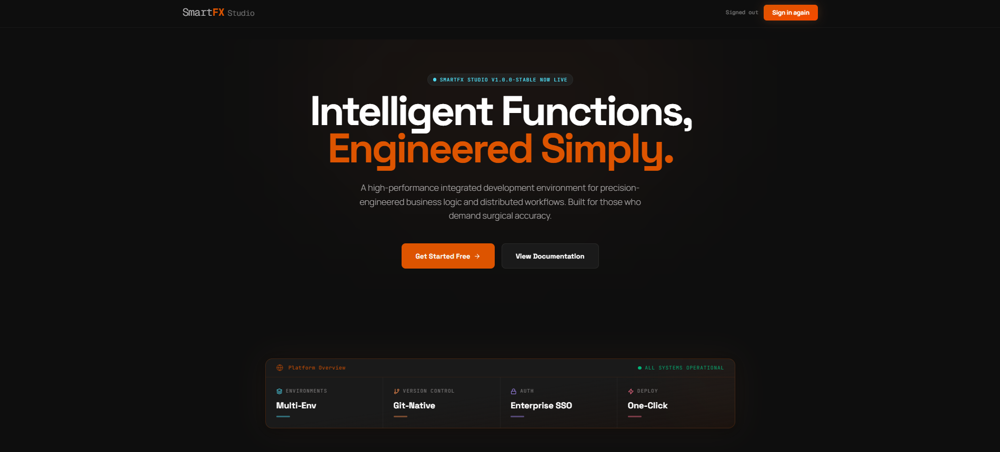

Click **Get Started Free** or **Sign In**.

---

## Step 2: Sign In

Login using:

- Email and Password  
- Microsoft  
- Google  

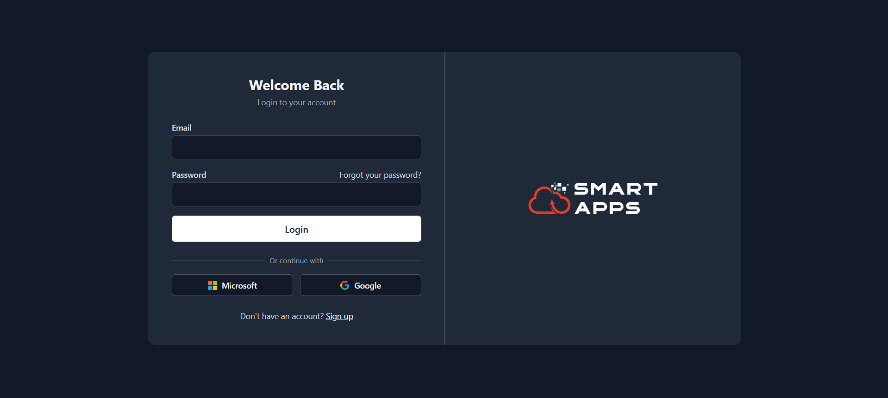

---

## Step 3: Create Your Project

After logging in:

- Enter Project Name  
- Add Repository Link  
- Provide Personal Access Token (PAT)  

Click **Clone & Create Project**.

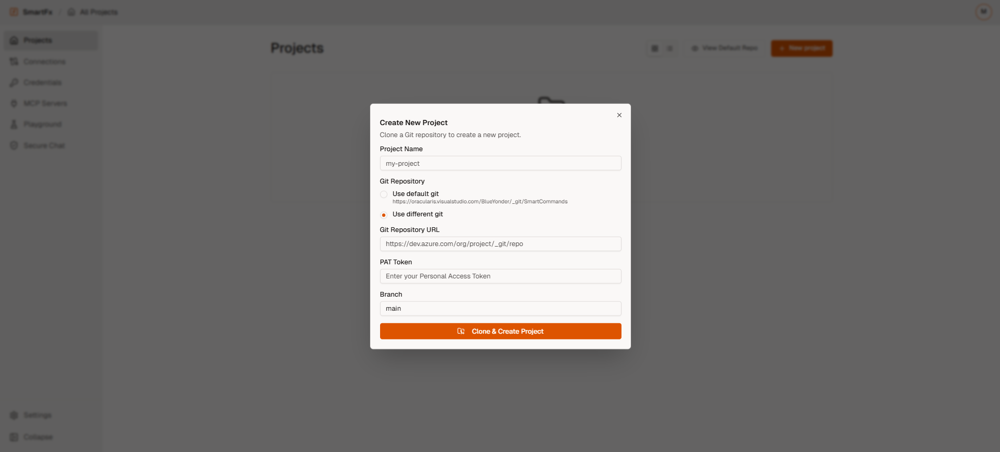

---

## Step 4: View Your Projects

After creating your project, you will be taken to the Projects section.

Here, you will see a list of all your projects.

- Locate your project in the list  
- Double-click on the project to open it  

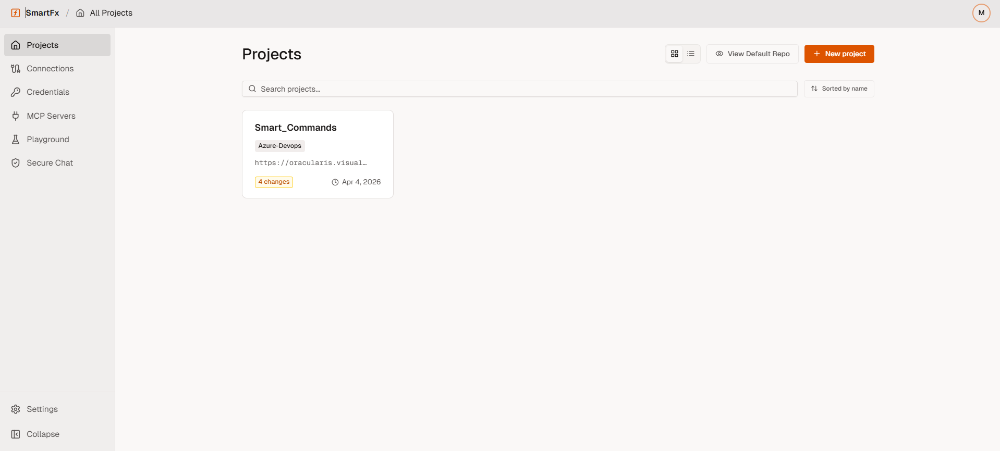

---

## Step 5: Work Inside Your Project

Once you open a project, the **Project Workspace** appears. This workspace includes:

- Code Editor (Smart Functions)  
- Tags  
- Input & Output Collections  
- Domains  
- Eval  
- Try It  

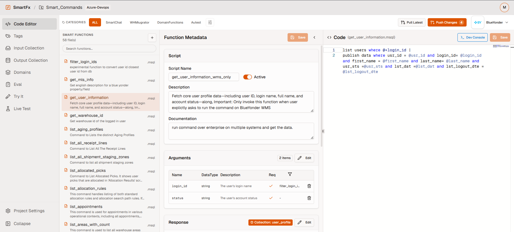

---

### 5.1 Code Editor (Smart Functions)

Watch the video:

<video controls width="800">
  <source src=".attachments/projects.mp4" type="video/mp4">
</video>

- Select a function (e.g., get_user_information)  
Inside the Code Editor, you can:
  - Modify function logic (code)

Update metadata:
  - Description
  - Inputs (arguments)
  - Outputs (responses)

Tips:
  - Keep descriptions clear (AI uses them)
  - Update inputs/outputs carefully to avoid errors s

Use Dev Console to connect to a system and run your function for instant results  

After making changes:
  - Save your updates
  - Add a commit message
  - Push changes to your repository
  - (Optional) Create a Pull Request
---

### 5.2 Tags

Watch the video:

<video controls width="800">
  <source src=".attachments/tags.mp4" type="video/mp4">
</video>

In the Tags section, you can:

- Create categories, subcategories, and topics  
- Edit or delete tags  
- Activate or deactivate them  

---

### 5.3 Input & Output Collections

Watch the video:

<video controls width="800">
  <source src=".attachments/input_output.mp4" type="video/mp4">
</video>

Here you can:

- Create new collections  
- Edit existing ones  
- Delete collections  

These define how your data is structured.

---

### 5.4 Domains

Watch the video:

<video controls width="800">
  <source src=".attachments/domain.mp4" type="video/mp4">
</video>

In the Domains section, you can:

- View all existing domains  
- Add new domains  
- Delete domains  
- Import domains using a .json file  

---

### 5.5 Eval

Watch the video:

<video controls width="800">
  <source src=".attachments/eval.mp4" type="video/mp4">
</video>

The **Eval** section allows you to validate your Smart Functions against AI models to ensure they are configured correctly.  

Steps:

1. **Select a System**  
   - Choose the system you want to evaluate functions for (e.g., Enterprise).

2. **Create Evaluation**  
   - Click **Create Evaluation** to start the process.  
   - All available functions for the selected system will appear.

3. **Select Functions**  
   - Choose one or more functions to evaluate.

4. **AI Model Evaluation**  
   - The system evaluates function definitions against AI models.  
   - It checks for issues such as tool-calling errors or configuration problems.

5. **View Results**  
   - Evaluation results are displayed in the interface.  
   - You can download the results or export them to your repository as a PDF.

This ensures that all your functions are properly configured and ready for use with Smart AI.

---

## Step 6: Connect to External Systems

The Connections section allows you to link Smart AI with external systems so your functions can retrieve and send data.

How to Create a Connection
1. Open the Connections Page
  - Navigate to the Connections section
  - Click the New Connection button
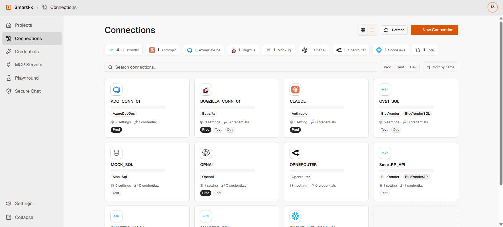
2. Select a Platform
  - Choose the platform or system you want to connect to
  - Available options depend on your organization setup

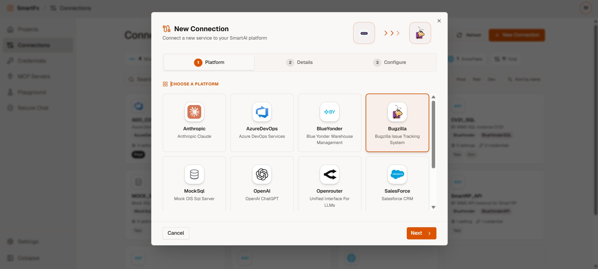
3. Enter Basic Details
  - Provide required details such as:
  - Connection name
  - Environment (e.g., Dev, QA, Prod)

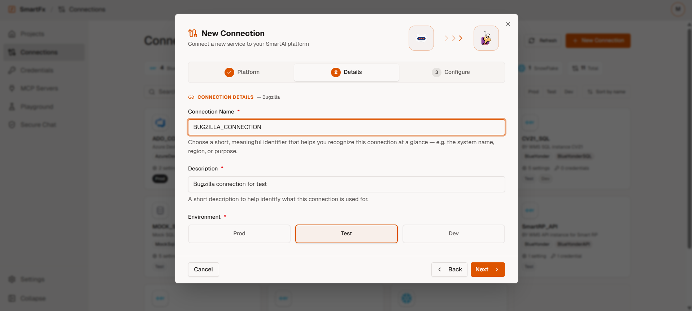

4. Configure Connection Settings
  - Enter the required configuration details, such as:
  - API endpoints / URLs
  - Username and password
  - Authentication keys (if required)
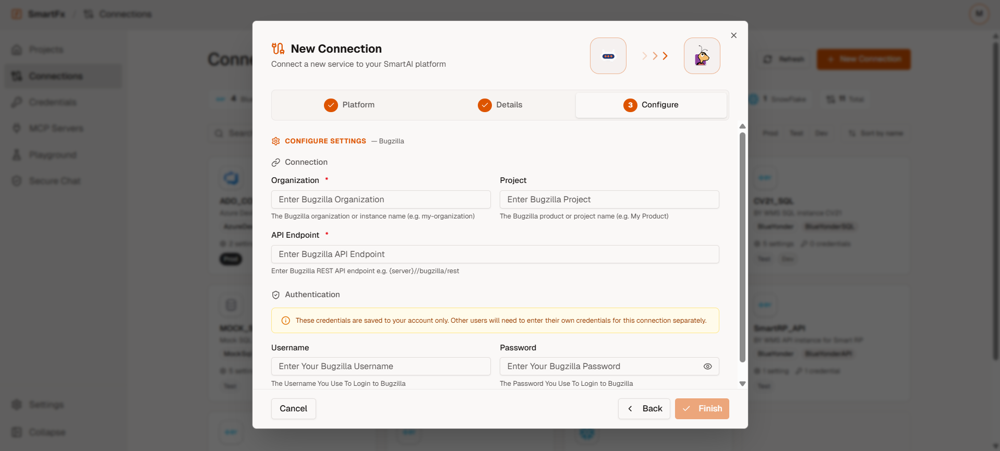

---
## Step 6: Add and Manage Credentials
1. Click on Add Credentials button to Add/Update your credentials for your system
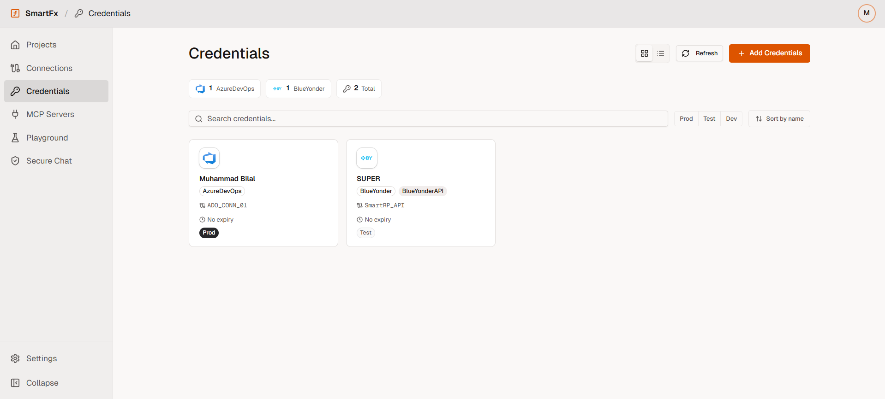

2. Select your connection from the drop down menu and Add/update your credential details.
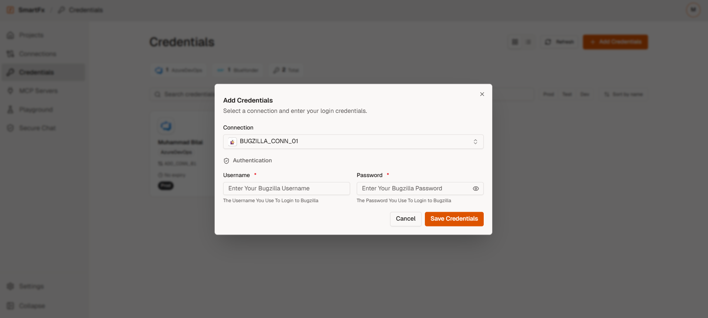

---
## Step 7: Configure MCP Server for your Functions

---
## Step 8: Secure Chat

Watch the demo:

<video controls width="800">
  <source src=".attachments/getting_started.mp4" type="video/mp4">
</video>

### Example

1. Open Secure Test  
2. Connect to a system  
3. Enter queries such as:

- Show me user information across the enterprise  
- Create a pie chart of users across systems  

You will receive:

- Instant results  
- Visualizations  
- Insights  

This is the primary way to interact with your system using natural language outside the project configuration.

---

## Notes

- All actions are secure and controlled  
- Only approved functions can run  
- No direct system access is allowed  
- Keep your Smart App Keys secure  

---

## You're Ready

You can now start exploring and using Smart AI effectively.