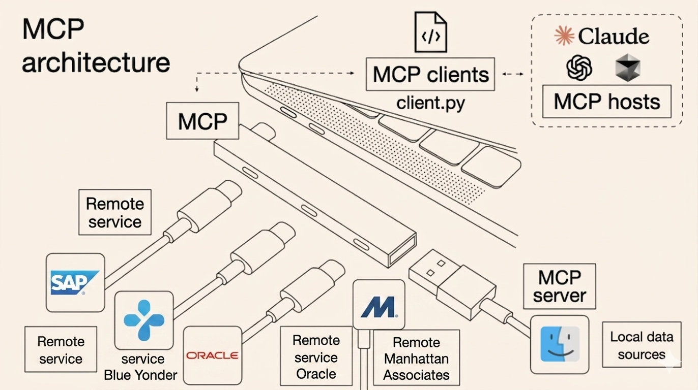

# MCP (Model Context Protocol)

MCP (Model Context Protocol) is a standard way for AI clients (like Claude Desktop) to discover and call **tools**.

In Smart AI, an MCP server exposes a curated set of **approved Smart Functions** from a specific **project + system** so external clients can:

- List the tools you published (names, descriptions, input schema)
- Call those tools with validated parameters
- Receive structured results back (tables/JSON), just like Smart Chat

This page stays intentionally short on “what is MCP” and focuses on **what it does in Smart AI** and **how to use it end-to-end**.

---

## Architecture

MCP acts as a standard protocol layer between external AI clients and Smart AI's governed enterprise functions:

1.  **Discovery**: AI clients automatically discover available tools with complete schema metadata
2.  **Validation**: All tool calls pass through Smart AI's existing governance, permissions, and validation layers
3.  **Execution**: MCP routes requests to the appropriate Smart Function with configured connections
4.  **Response**: Structured results are returned in a standardized format compatible with all MCP clients

All existing enterprise controls, audit logging, and security policies apply identically to MCP calls.

---

## When you should use MCP with Smart AI

Use MCP when you want Smart AI’s governed enterprise tools to be available **outside** the Smart AI UI:

- **Run enterprise lookups from a desktop AI client** (e.g., check order status without switching apps)
- **Standardize access**: one governed tool catalog for multiple clients (desktop, IDE, agents)
- **Enable automation**: compose Smart Functions inside larger agent workflows

If your goal is only “chat with enterprise systems”, Smart Chat is usually the fastest path. MCP is best when you need **tool access in another client**.

---

## Prerequisites (what must exist before MCP will be useful)

Before generating an MCP server, make sure these are already done:

1. **Project is connected to a Smart Functions repository**
   - This is where your Smart Functions (code + metadata) live and are versioned.
2. **Functions are in a usable state**
   - Good descriptions, correct inputs/outputs, and tested in Dev Console.
   - (Recommended) An Eval run looks good for the functions you plan to expose.
3. **Connections + credentials are configured**
   - MCP tools call the same governed functions; they still need working connections.

---

## Create an MCP server in Smart FX

1. Go to **MCP Servers**
2. Click **Generate New MCP Server Link**
3. Select the **system** (for example: `Enterprise`)
4. Enter a clear server name
5. Click **Generate Link**

After generation, open the MCP server link to view details:

- **Server URL**
- **Connections** bound to this server/system
- The **tool list** (your Smart Functions) that clients will discover and call

---

## What the MCP Server Details page is telling you

### Tool list

This is the contract external clients will see. Tools appear here only if they are:

- In the selected project/system scope
- Approved/published (depending on your org’s governance settings)
- Valid enough to be exposed (metadata and schema are required)

### Export

The **Export** section is the safest source of truth for client setup. It typically provides:

- Client-specific configuration snippets
- Any required auth headers/tokens (if your org requires them)
- Notes on supported transport (HTTP/SSE/stdio) for that client

---

## Setup via custom connector (Claude example)

1.  Open **claude.ai** → Profile → **Settings** → **Connectors**
2.  Click **Add custom connector** at the bottom
3.  Paste your generated MCP Server URL
4.  Click **Add** and complete authentication if prompted

✅ Once connected, server tools appear in the chat attachment menu (paperclip icon).you can also manage permissions from Connectors settings.

> 🎥 Full video walkthrough with connection demo

<video controls width="800">
  <source src=".attachments/mcp_example.mp4" type="video/mp4">
</video>

---

