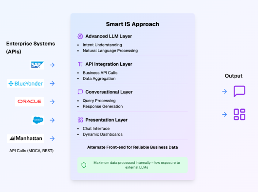
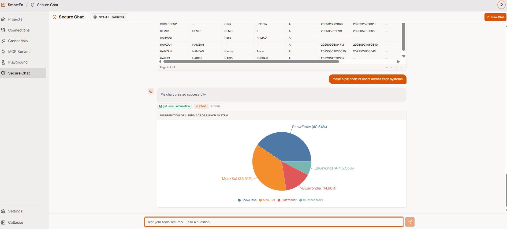
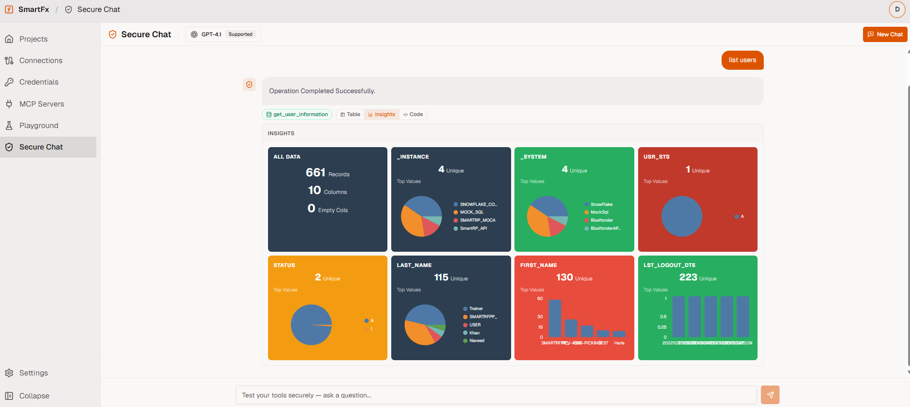
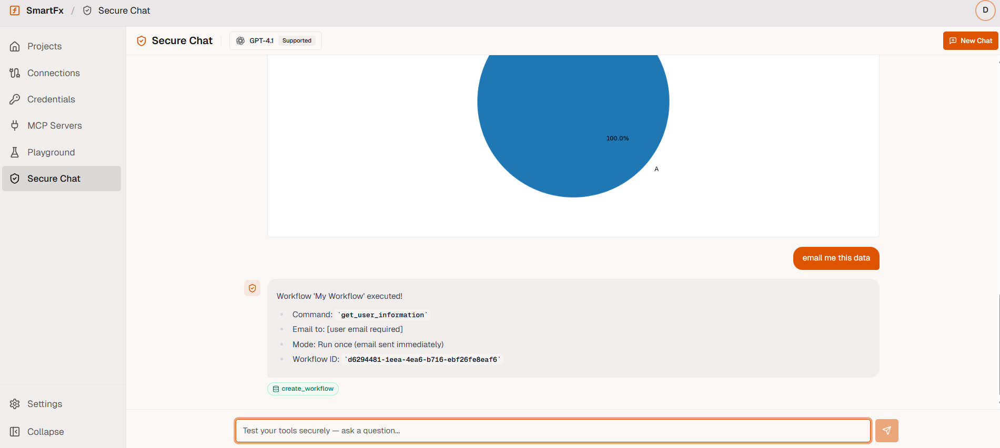
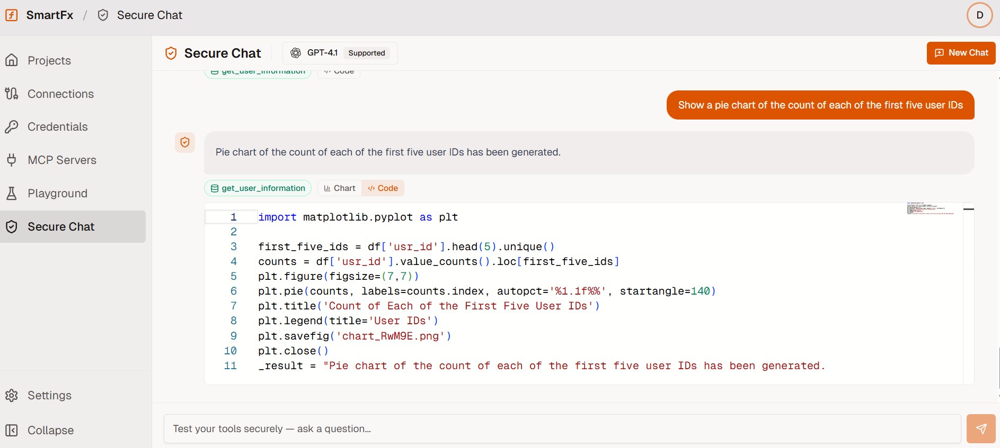
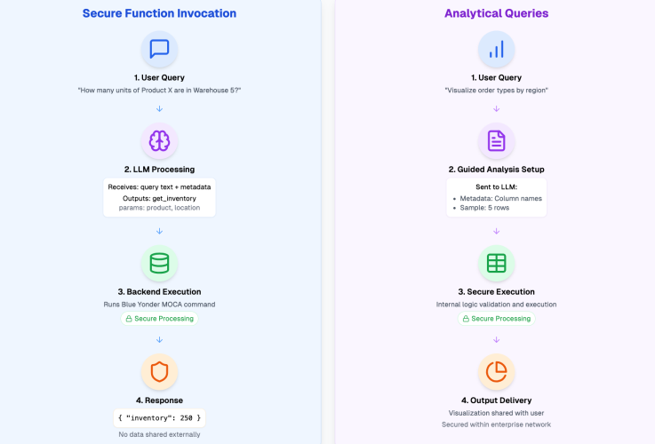

# Smart Chat

Smart Chat is the secure conversational chat interface of Smart AI that helps you interact with connected enterprise systems.

## What you can do in Smart Chat

- Ask questions that return live operational data (for example orders, inventory, shipments, devices).
- Run approved actions and workflows (only when allowed by your role).
- Ask follow-up questions without repeating context.
- Turn results into summaries, charts, and dashboards.
- See what happened behind the scenes (when enabled for your role).

## Common use cases

- **Where is my order?** Get a single, trusted status even when data is split across systems.
- **Inventory check**: See stock levels for a SKU/location and get a consolidated view when configured.
- **Operational lookups**: Quickly pull details for orders, waves, locations, devices, shipments, and exceptions.
- **Cross-system workflows**: Ask once and let Smart AI coordinate multiple approved steps.

## Example prompts (warehouse)

- "Show me details of order 123."
- "Show me area information for Building 3PSTG."
- "Give me a list of all devices."
- "How many units of Product X are in Warehouse 5?"

## Why Smart Chat is different from “document chat”

Smart Chat is designed for operations and execution. Instead of only searching documents (PDFs, wikis, emails), it focuses on **structured, actionable integrations** (approved APIs/commands/workflows). That means you can get live, up-to-date results—and perform approved actions—without needing to know the underlying system details.

Unlike traditional document chat systems:
| Feature | Document Chat | Smart Chat |
|---------|---------------|------------|
| Data Source | Static unstructured documents | Live enterprise systems |
| Actionability | Only answers questions | Can run approved workflows |
| Data Freshness | Outdated when documents are old | Real-time live data |
| Accuracy | Dependent on document quality | 100% accurate system data |
| Capabilities | Information only | Read + Write operations |

## Follow-up questions (context-aware)

After Smart AI returns a table or dataset, you can refine it:

- "Only show the delayed ones."
- "Group by status."
- "Show totals by warehouse."
- "Export this."

## Generate Charts using Natural Language

If the last response returned a dataset, you can request a visualization:

- “Create a pie chart from this.”
- “Show a bar chart by order type.”
- “Make a time-series chart by ship date.”

Supported chart types typically include **pie, line, bar, stacked, and bubble** (availability may depend on your deployment).

## Auto-generated dashboard

You can ask Smart AI to turn the latest dataset into an interactive dashboard.
Smart AI identifies key fields and data types and generates charts/metrics to highlight trends.

Dashboards are created automatically without any manual configuration, with intelligent chart type selection based on your data patterns. You get:
- Automatic trend detection
- Relevant metric cards
- Filterable interactive views
- Multiple visualization types in single view

## Automated Workflows

Smart Chat doesn't just answer questions — you can create repeatable automated workflows directly from your chat conversation:

Supported workflow actions:
- Schedule recurring reports (daily/weekly shipment reports, inventory summaries)
- Set up threshold alerts (notify when stock levels drop below limits)
- Email datasets or analysis results directly from chat
- Manage existing workflows: list, pause, resume, or cancel

Workflows run securely inside your environment with full audit history and role-based access controls.

## What happens behind the scenes (simplified)

When you ask something in Smart Chat, Smart AI typically:

1. Understands your request (what you want + key details like order number, warehouse, SKU).
2. Matches it to an **approved Smart Function** (a pre-defined capability your organization allows).
3. Validates it (required inputs, allowed values, and permission checks).
4. Sends the request to the right system(s) and gathers results.
5. Returns the answer in a user-friendly format (table, summary, chart, dashboard).

For questions that span multiple systems, Smart AI can query systems in parallel and merge results into a single answer (so you don’t have to check multiple screens).

## Transparency

When enabled, Smart AI will show you **exactly what code was generated and executed** for your request:

This lets you:
- Verify the exact command that ran
- Troubleshoot results
- Understand how your question translated to system code

## Security (what end users should know)

- Smart AI runs **approved functions only**. If something is not approved, it won’t run. No arbitrary code execution.
- Access is controlled by your existing enterprise role permissions (you only see and run what you’re allowed to).
- All sensitive data stays inside your network boundaries
- For analytics (charts/dashboards), Smart AI uses a controlled approach: it only sends column names and small data samples to understand how to summarize results, while keeping full datasets 100% protected inside your environment.
- No raw business data is ever sent to external language models. Only the user's question text is processed externally for intent recognition.
